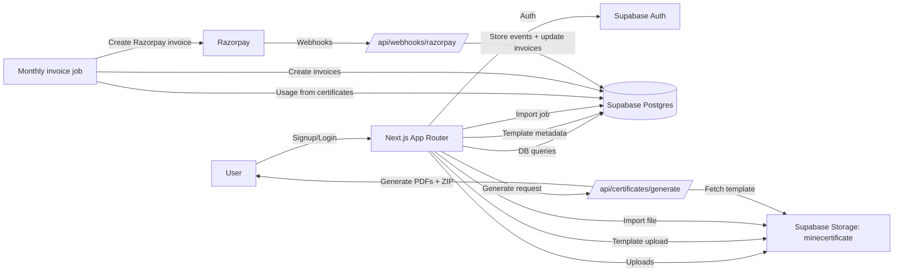

# MineCertificate Architecture Summary

## Scope and sources
- Repository scanned: /Users/int/Desktop/MineCertificate
- Primary schema reference: DATABASE_DESIGN_LIVE.md (live schema snapshot + relationships)
- Note: node_modules/ and .next/ are vendor/build outputs and are not enumerated below.

## Product overview
MineCertificate is a multi-tenant certificate generation and verification platform. It provides:
- Template management (PDF/image templates + positioned fields)
- Bulk imports (CSV/XLSX) and mapping to template fields
- Certificate generation with QR codes
- Billing and invoicing (Razorpay)
- Audit and verification logs

## Tech stack
- Frontend: Next.js 15 (App Router), React 18, TypeScript
- Styling: Tailwind CSS, shadcn/ui (Radix UI primitives), lucide-react icons
- Backend: Supabase (PostgreSQL, Auth, Storage, Realtime)
- Billing: Razorpay API + webhook handler
- File processing: pdf-lib, qrcode, jszip, xlsx, date-fns
- Tooling: ESLint, PostCSS, Tailwind, npm

## Runtime architecture
- Next.js App Router provides server components (billing pages) and client components (interactive dashboards).
- Supabase is the backend of record:
  - Auth: session management via @supabase/ssr
  - Database: PostgreSQL with RLS for tenant isolation
  - Storage: Supabase Storage for templates, logos, imports
- Billing jobs run server-side with service-role Supabase client and Razorpay SDK.

## Data model (from DATABASE_DESIGN_LIVE.md)
### Tenancy and identity
- companies: tenant record, branding, billing config, API access flags
- users: per-tenant users linked to auth.users and companies
- company_settings: per-company configuration
- user_invitations: invitation workflow for team members

### Templates
- certificate_categories: hierarchical categories (parent/child) for template organization
- certificate_templates: template metadata, storage_path, fields JSON, status, and category links

### Certificates and verification
- certificates: issued certificates with template linkage, status, verification token, invoice linkage
- certificate_events: append-only event log for certificate lifecycle
- verification_logs: public verification audit trail

### Imports
- import_jobs: uploaded CSV/XLSX metadata, status, mapping, storage_path
- import_data_rows: normalized row storage for import jobs

### Messaging
- email_templates, email_messages: templated email system and message delivery records
- whatsapp_templates, whatsapp_messages: WhatsApp template and delivery records

### Billing and payments
- billing_profiles: per-company pricing, tax, and Razorpay customer metadata
- invoices: monthly invoices, status, and Razorpay linkage
- invoice_line_items: line-item breakdown for invoices
- razorpay_events: immutable webhook event store
- razorpay_refunds: refund tracking

### Auditing
- audit_logs: append-only audit log for sensitive actions

### Key relationships (selected)
- users.company_id -> companies.id
- certificate_templates.company_id -> companies.id
- certificate_templates.certificate_category_id -> certificate_categories.id
- certificates.company_id -> companies.id
- certificates.certificate_template_id -> certificate_templates.id
- certificates.invoice_id -> invoices.id
- import_jobs.company_id -> companies.id
- import_data_rows.import_job_id -> import_jobs.id
- invoice_line_items.invoice_id -> invoices.id
- verification_logs.company_id -> companies.id

## Storage and media
- Primary bucket in app code: minecertificate
  - company-logos/{application_id or company_id}/logo_<timestamp>.ext
  - templates/{application_id or company_id}/{timestamp}_{rand}.ext
  - imports/{company_id}/{timestamp}_{rand}.ext
- Template previews:
  - Stored as public URLs via getPublicUrl
  - Rendered using signed URLs (1 hour expiry) for secure access in UI
- Imports:
  - Uploaded to minecertificate bucket and referenced in import_jobs.storage_path
- Generated certificates:
  - Current API returns a base64 ZIP payload (not persisted in storage)

Note: Several SQL/scripts reference separate buckets (templates/certificates/imports/assets), but the live app code uses a single bucket (minecertificate) with folder prefixes.

## Auth and security
- Supabase Auth handles login and signup; user metadata is stored in auth.users
- Database trigger (06_ADD_SIGNUP_TRIGGER.sql) creates companies and users on signup
- RLS policies enforce company_id scoping across tables
- API key auth:
  - application_id + API key in headers
  - API key hashed with SHA-256 in companies.api_key_hash
  - validateApplicationId/validateAPIKey enforce formats
- Environment guards:
  - lib/utils/guards.ts restricts production-only actions
  - Razorpay webhook endpoint asserts production-only and safety flags
- Webhook verification:
  - HMAC SHA256 signature validation for Razorpay events
  - Events stored immutably in razorpay_events

## Core system flows
### Signup and onboarding
1. /signup uses Supabase auth.signUp with metadata (full_name, company_name).
2. DB trigger creates a companies row and a users row (admin).
3. Onboarding modal prompts for industry and updates companies.industry.

### Login and session
1. /login calls auth.signInWithPassword.
2. On success, user is redirected to /dashboard.
3. Dashboard layout loads user profile and company data from users and companies.

### Template management
1. User uploads a PDF/image (TemplateUploadDialog).
2. File stored in Supabase Storage; template metadata saved in certificate_templates.
3. Templates list shows previews and categories; soft delete sets deleted_at/status=archived.

### Certificate design
1. Generate page loads active certificate_templates for the company.
2. User selects template (signed URL) or uploads a new one.
3. Fields are placed on canvas and autosaved back to certificate_templates.fields.
4. Template dimensions are saved back to certificate_templates.width/height.

### Imports
1. Import page uploads CSV/XLSX to storage and inserts import_jobs row.
2. Data preview and category selection occur client-side with XLSX parsing.
3. Generate page can load completed import_jobs for mapping and export.

### Certificate generation
1. ExportSection posts to /api/certificates/generate with template, data, mappings.
2. API fetches template PDF/image, overlays fields, generates QR codes, zips PDFs.
3. Result is returned as a base64 data URL for direct download.

### Verification
- QR codes point to /verify/<token> (route not present in repo).
- Verification events should be stored in verification_logs (not yet wired in UI routes).

### Billing and invoices
1. Monthly job calculates usage from certificates and billing_profiles.
2. Creates invoices and invoice_line_items; attaches certificates to invoice_id.
3. Razorpay invoice is created; payment link stored in invoices.
4. /api/webhooks/razorpay processes events and updates invoice status.

## Pages and UI components (with sections and inputs)
### Public and auth routes
- / (app/page.tsx): redirects to /login.
- /login (app/(auth)/login/page.tsx)
  - Sections: logo header, email/password form, forgot link, error banner, submit button, sign-up link.
  - Inputs: email, password (toggle show/hide).
  - Data: Supabase auth.signInWithPassword.
- /signup (app/(auth)/signup/page.tsx)
  - Sections: header, sign-up form, error/success banner, terms/privacy links.
  - Inputs: full name, company name, business email, password (min 6).
  - Data: Supabase auth.signUp with user metadata.

### Dashboard layout and navigation
- app/dashboard/layout.tsx
  - Sidebar: nav links for Dashboard, Templates, Generate, Imports, Certificates, Verification, Billing, Users, Settings.
  - Top bar: notifications button, user menu, theme toggle (light/dark/system).
  - Data: users -> companies lookup for profileName/companyName/logo.
  - OnboardingModal mounted globally.

### /dashboard (app/dashboard/page.tsx)
- Sections: header, KPI cards, empty state or activity grid.
- Data:
  - users -> company_id
  - certificates count + revoked count
  - import_jobs (pending and recent)
  - verification_logs (recent)

### /dashboard/company (app/dashboard/company/page.tsx)
- Sections:
  - Logo upload and basic info
  - Address details
  - Tax info
- Inputs: name, email, phone, website, industry, address, city, state, country, postal_code, gst_number, cin_number, logo file.
- Data:
  - users -> company_id
  - companies fetch/update
  - Storage upload to minecertificate/company-logos

### /dashboard/templates (app/dashboard/templates/page.tsx)
- Sections:
  - Header with Upload action
  - Template cards with preview, status, categories
  - Preview modal and delete confirmation modal
- Data:
  - users -> company_id
  - certificate_templates + certificate_categories (category/subcategory)
  - Signed URLs for preview
  - Soft delete by setting deleted_at and status=archived

### /dashboard/generate-certificate (app/dashboard/generate-certificate/page.tsx)
- Multi-step workflow: template -> design -> data -> export
- Template step: TemplateSelector (carousel + upload dialog)
- Design step:
  - Left: FieldTypeSelector + FieldLayersList (add/delete/hide fields)
  - Center: CertificateCanvas with drag/resize/zoom/pan
  - Right: RightPanel field properties editor
- Data step: DataSelector (upload or use recent imports, column mapping)
- Export step: ExportSection (file name, QR toggle, generate, download)
- Data:
  - certificate_templates (active)
  - import_jobs (completed)
  - autosave fields and dimensions back to certificate_templates

### /dashboard/imports (app/dashboard/imports/page.tsx)
- Sections: header + sample file download, info alert, upload card, preview table, category selection, submit.
- Inputs: file upload (CSV/XLSX), category, subcategory, optional template.
- Data:
  - certificate_categories (system + company)
  - certificate_templates (active)
  - import_jobs insert
  - Storage upload to minecertificate/imports

### /dashboard/certificates (app/dashboard/certificates/page.tsx)
- UI-only stub with search and empty state (no DB wiring yet).

### /dashboard/verification-logs (app/dashboard/verification-logs/page.tsx)
- UI-only stub with empty state (no DB wiring yet).

### /dashboard/users (app/dashboard/users/page.tsx)
- UI-only stub for team members (no DB wiring yet).

### /dashboard/settings (app/dashboard/settings/page.tsx)
- Settings grid linking to Company Profile and API Settings; other sections are placeholders.

### /dashboard/settings/api (app/dashboard/settings/api/page.tsx)
- Sections: Application ID display, API key management, API usage example.
- Inputs: generate/rotate API key, enable/disable API, copy actions.
- Data:
  - users -> company_id
  - companies (application_id, api_enabled, api_key_hash, timestamps)
  - Server actions bootstrapCompanyIdentity/rotateAPIKey

### /dashboard/billing (app/dashboard/billing/page.tsx)
- Server component that loads user/company and renders billing overview and invoice list.
- Data: users -> company_id; companies (name)

### /dashboard/billing/invoices/[id] (app/dashboard/billing/invoices/[id]/page.tsx)
- Server component verifying invoice ownership and rendering InvoiceDetail.

### API routes
- POST /api/certificates/generate
  - Generates PDFs from template fields + data; returns ZIP data URL.
  - Uses pdf-lib, qrcode, jszip.
- POST /api/admin/generate-invoices
  - Triggers monthly invoice job or single-company run.
- GET /api/admin/generate-invoices
  - Returns help/usage details.
- POST /api/webhooks/razorpay
  - Verifies signatures, stores events, updates invoices.
- app/api/example-guarded-route.ts.example
  - Reference implementation for environment guards (not active).

### Shared components
- components/onboarding/OnboardingModal.tsx
  - Modal prompting industry selection; updates companies.industry.
- components/templates/TemplateUploadDialog.tsx
  - Upload flow for templates; category selection; writes certificate_templates and uploads to storage.
- components/ui/*
  - Shadcn/Radix wrappers for Button, Input, Select, Dialog, etc.

### Generate-certificate subcomponents
- FieldTypeSelector: adds typed fields (name/course/date/custom/QR) centered on template.
- FieldLayersList: list of fields with visibility toggle and delete action.
- CertificateCanvas: renders template preview, draggable fields, zoom/pan, template resize handle.
- DraggableField: drag/resize overlay with selection and delete affordances.
- RightPanel: field properties editor (position, size, typography, color, prefix/suffix).
- TemplateSelector: carousel of saved templates + upload dialog; computes dimensions.
- AssetLibrary: local-only asset list for logos/signatures/stamps (not persisted yet).
- DataSelector: upload or load recent imports; map columns to fields.
- DataImporter: legacy/simple import UI (not used in current page).
- ExportSection: POSTs to /api/certificates/generate and handles download.
- TemplateUploader, LeftPanel, PDFViewer, PDFThumbnail: supporting/legacy UI building blocks.

## Notable gaps and mismatches
- /verify/[token], /forgot-password, /terms, /privacy, and /onboarding routes are referenced but not implemented in app/.
- Imports page writes import_jobs.storage_path, while Generate page tries import_jobs.file_storage_path and uses bucket name imports; schema/code mismatch to resolve.
- SQL migrations reference templates table, but app uses certificate_templates and certificate_categories (aligned with live schema).

## System flow diagram

## File-by-file breakdown
### Root and config
- README.md: product overview, features, setup, and high-level structure.
- DATABASE_DESIGN_LIVE.md: live database schema, relationships, and RLS/index references.
- database-inspection-complete.json: one-off inspection snapshot (tables + samples).
- database-inspection-results.json: storage bucket inspection snapshot.
- package.json: dependencies and scripts (next dev/build/start/lint).
- package-lock.json: npm dependency lockfile.
- next.config.js: Next.js config, image domain allowlist for Supabase.
- tailwind.config.ts: Tailwind theme, colors, and content paths.
- postcss.config.mjs: Tailwind + autoprefixer config.
- tsconfig.json: TypeScript config for Next.js.
- next-env.d.ts: Next.js type references (generated).
- tsconfig.tsbuildinfo: TypeScript build cache (generated).
- .eslintrc.json: ESLint config (next/core-web-vitals).
- .gitignore: ignore rules, includes env files and build outputs.
- temp.ipynb: temporary notebook (not referenced by app).
- .env.local: local secrets and Supabase credentials (not inspected).
- node_modules/: third-party dependencies (not enumerated).
- .next/: Next.js build output (not enumerated).
- .claude/: tool metadata (not enumerated).

### app/
- app/layout.tsx: root layout, global metadata, Inter font, globals.css.
- app/globals.css: CSS variables, light/dark theme colors, base styles.
- app/page.tsx: redirects "/" to "/login".
- app/(auth)/login/page.tsx: login form and Supabase password auth.
- app/(auth)/signup/page.tsx: signup form with business email validation.
- app/dashboard/layout.tsx: dashboard shell (sidebar, top bar, theme, user menu).
- app/dashboard/page.tsx: dashboard KPIs, recent imports/verifications.
- app/dashboard/company/page.tsx: company profile editor + logo upload.
- app/dashboard/templates/page.tsx: template list, preview, delete, upload dialog.
- app/dashboard/imports/page.tsx: CSV/XLSX upload and import_jobs insert.
- app/dashboard/certificates/page.tsx: certificates list stub UI.
- app/dashboard/verification-logs/page.tsx: verification logs stub UI.
- app/dashboard/users/page.tsx: team management stub UI.
- app/dashboard/settings/page.tsx: settings launcher grid.
- app/dashboard/settings/api/page.tsx: API key management UI.
- app/dashboard/billing/page.tsx: server page, renders BillingOverview + InvoiceList.
- app/dashboard/billing/components/billing-overview.tsx: live usage + estimated bill.
- app/dashboard/billing/components/invoice-list.tsx: invoice history table.
- app/dashboard/billing/components/invoice-detail.tsx: full invoice details.
- app/dashboard/billing/invoices/[id]/page.tsx: invoice detail route with ownership checks.
- app/dashboard/generate-certificate/page.tsx: multi-step certificate builder.
- app/dashboard/generate-certificate/components/CertificateCanvas.tsx: canvas with zoom/pan and template resize.
- app/dashboard/generate-certificate/components/DraggableField.tsx: draggable/resizable overlay fields.
- app/dashboard/generate-certificate/components/FieldTypeSelector.tsx: add-field palette.
- app/dashboard/generate-certificate/components/FieldLayersList.tsx: field list with visibility and delete.
- app/dashboard/generate-certificate/components/RightPanel.tsx: field property editor.
- app/dashboard/generate-certificate/components/TemplateSelector.tsx: template carousel + upload dialog.
- app/dashboard/generate-certificate/components/AssetLibrary.tsx: local assets UI (not persisted).
- app/dashboard/generate-certificate/components/DataSelector.tsx: import + mapping UI.
- app/dashboard/generate-certificate/components/DataImporter.tsx: legacy import UI.
- app/dashboard/generate-certificate/components/ExportSection.tsx: generate + download.
- app/dashboard/generate-certificate/components/TemplateUploader.tsx: PDF/image upload helper.
- app/dashboard/generate-certificate/components/LeftPanel.tsx: legacy tabbed sidebar UI.
- app/dashboard/generate-certificate/components/PDFViewer.tsx: react-pdf viewer (not used).
- app/dashboard/generate-certificate/components/PDFThumbnail.tsx: PDF preview in carousel.
- app/api/certificates/generate/route.ts: PDF generation API endpoint.
- app/api/admin/generate-invoices/route.ts: billing job trigger endpoint.
- app/api/webhooks/razorpay/route.ts: Razorpay webhook receiver and processor.
- app/api/example-guarded-route.ts.example: example guarded routes (not active).

### components/
- components/onboarding/OnboardingModal.tsx: industry setup modal.
- components/templates/TemplateUploadDialog.tsx: template upload dialog.
- components/ui/button.tsx: button variants (shadcn).
- components/ui/input.tsx: input field (shadcn).
- components/ui/select.tsx: select dropdown (Radix).
- components/ui/dropdown-menu.tsx: dropdown menu (Radix).
- components/ui/separator.tsx: horizontal/vertical separator.
- components/ui/badge.tsx: badge variants.
- components/ui/dialog.tsx: modal dialog (Radix).
- components/ui/switch.tsx: switch toggle (Radix).
- components/ui/alert.tsx: alert box variants.
- components/ui/label.tsx: form label.
- components/ui/card.tsx: card layout components.
- components/ui/tabs.tsx: tabs primitives.

### lib/
- lib/supabase/client.ts: browser Supabase client (anon key).
- lib/supabase/server.ts: server Supabase client with cookie integration.
- lib/api/auth.ts: API key auth middleware (application_id + API key).
- lib/actions/bootstrap-identity.ts: server actions to generate/rotate API keys.
- lib/utils.ts: cn() helper for class name merging.
- lib/utils/guards.ts: environment and safety guards.
- lib/utils/environment.ts: environment resolver (dev/test/beta/prod).
- lib/utils/ids.ts: application_id and API key generation + hashing.
- lib/courses.ts: static list of courses for dropdowns.
- lib/types/certificate.ts: certificate field types, fonts, export types.
- lib/razorpay/webhook-verification.ts: signature verification + payload helpers.
- lib/razorpay/invoice-helpers.ts: invoice metadata helpers.
- lib/billing/types.ts: billing domain types.
- lib/billing/billing-period.ts: billing period utilities.
- lib/billing/usage-aggregator.ts: counts unbilled certificates and attaches to invoices.
- lib/billing/invoice-calculator.ts: line-item and tax calculations.
- lib/billing/razorpay-client.ts: Razorpay client + invoice creation.
- lib/billing/invoice-generator.ts: end-to-end invoice creation.
- lib/billing/monthly-invoice-job.ts: batch billing job runner.
- lib/billing/README.md: billing module documentation.
- lib/billing-ui/types.ts: UI types for invoices and profiles.
- lib/billing-ui/hooks/use-billing-overview.ts: live usage hook.
- lib/billing-ui/hooks/use-invoice-list.ts: invoice list hook + realtime.
- lib/billing-ui/hooks/use-invoice-detail.ts: invoice detail hook + realtime.
- lib/billing-ui/utils/currency-formatter.ts: currency formatting helpers.
- lib/billing-ui/utils/invoice-helpers.ts: invoice status and date helpers.

### scripts/
- scripts/inspect-db-direct.mjs: live DB inspection with hardcoded service key.
- scripts/inspect-database.mjs: DB + storage inspection (RPC-based).
- scripts/get-full-schema.mjs: prints schema queries for Supabase SQL editor.
- scripts/audit-current-schema.ts: audits tables and RLS state.
- scripts/verify-database.ts: verifies company credentials and schema state.
- scripts/verify-auth.ts: tests API key validation and storage path expectations.
- scripts/bootstrap-xencus.ts: one-time credential bootstrap for Xencus tenant.
- scripts/migrate-storage-paths.ts: moves storage paths from app_id to application_id.
- scripts/verify-phase3.ts: validates app_id removal and application_id hardening.
- scripts/verify-phase4.ts: validates schema hardening across tables.
- scripts/verify-phase5.ts: validates environment guards and downgrades.
- scripts/fix-storage.js: creates missing buckets based on .env.local.
- scripts/check-storage.mjs: same goal with @next/env loading.
- scripts/setup-storage.js: creates buckets and reminds to run SQL policies.
- scripts/cleanup-buckets.js: deletes duplicate buckets in favor of minecertificate.
- scripts/fix-templates-table.js: adds fields/width/height columns to templates table.

### supabase/
- supabase/setup.sql: initial schema (companies/users/templates/import_jobs/certificates).
- supabase/storage-setup.sql: storage buckets + policies (separate buckets model).
- supabase/update_companies.sql: adds company profile fields to companies.
- supabase/update_templates.sql: adds course_name and file_type to templates.
- supabase/fix-templates-schema.sql: adds fields/width/height columns.
- supabase/01_PRE_MIGRATION.sql: pre-migration column normalization.
- supabase/03_CLEANUP_APP_ID.sql: drop legacy app_id and harden application_id.
- supabase/04_HARDEN_SCHEMA.sql: constraints, indexes, immutability, RLS.
- supabase/05_ENVIRONMENT_TRACKING.sql: environment column and downgrade guard.
- supabase/06_ADD_SIGNUP_TRIGGER.sql: auth signup trigger for user/company.
- supabase/migration-2026-01-06.sql: comprehensive migration (adds categories, invites, billing).
- supabase/PRODUCTION_MIGRATION.sql: production migration v1 (additive).
- supabase/FINAL_MIGRATION.sql: production migration (adds API/billing fields).
- supabase/FINAL_PRODUCTION_MIGRATION.sql: production migration v2 (full scale).
- supabase/FINAL_PRODUCTION_MIGRATION_FIXED.sql: corrected v2 migration.
- supabase/RUN_THIS_MIGRATION.sql: migration variant for empty/unknown schemas.
- supabase/POST_MIGRATION_VERIFICATION.sql: verification queries.
