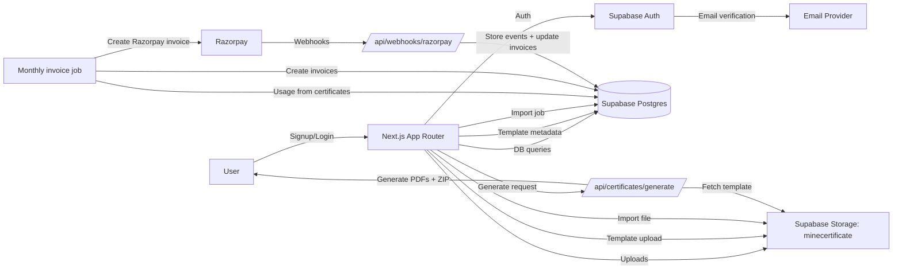

# MineCertificate Architecture Summary

## Scope and sources
- Repository scanned: /Users/int/Documents/GitHub/MineCertificate
- Primary schema reference: DATABASE_DESIGN_LIVE.md (live schema snapshot + relationships + storage)
- Note: node_modules/ and .next/ are vendor/build outputs and are not enumerated below.

## Product overview
MineCertificate is a multi-tenant certificate generation and verification platform. It provides:
- Certificate template management (PDF/image templates + positioned fields)
- Bulk imports (CSV/XLSX) and mapping to template fields
- Certificate PDF generation with QR codes
- Billing and invoicing (Razorpay)
- Audit, verification, and messaging logs

## Tech stack
- Frontend: Next.js 15 (App Router), React 18, TypeScript
- Styling: Tailwind CSS, shadcn/ui (Radix UI primitives), lucide-react icons
- Backend: Supabase (PostgreSQL, Auth, Storage, Realtime)
- Billing: Razorpay API + webhook handler
- File processing: pdf-lib, qrcode, jszip, xlsx, date-fns
- Tooling: ESLint, PostCSS, Tailwind, npm

## Runtime architecture
- Next.js App Router provides client components for dashboards and a small set of server components for billing pages.
- Supabase is the backend of record:
  - Auth: email/password with verification; session handled via @supabase/ssr
  - Database: PostgreSQL with RLS for tenant isolation
  - Storage: Supabase Storage bucket "minecertificate" for templates, logos, and imports
- Billing jobs run server-side with service-role Supabase client and Razorpay SDK.

## Data model (from DATABASE_DESIGN_LIVE.md)
### Tenancy and identity
- companies: tenant record, branding, billing config, API access flags, application_id
- users: per-tenant users linked to auth.users and companies
- company_settings: per-company configuration (branding, email/whatsapp settings)
- user_invitations: invitation workflow for team members

### Templates and categories
- certificate_categories: industry-specific category rows with certificate_category and certificate_subcategory text fields, optionally scoped to company_id
- certificate_templates: template metadata, storage_path, preview_url, fields JSON, dimensions, status, and category snapshots
  - UI uses certificate_category and certificate_subcategory text fields
  - Schema also has certificate_category_id / certificate_subcategory_id for FK linkage

### Certificates and verification
- certificates: issued certificates with template linkage, status, verification token, snapshots, invoice linkage
- certificate_events: append-only event log for certificate lifecycle
- verification_logs: public verification audit trail

### Imports
- import_jobs: upload metadata, storage_path, status, counts, mapping JSON, and legacy file_storage_path
- import_data_rows: optional normalized row storage for import jobs

### Messaging
- email_templates, email_messages: template library and send log
- whatsapp_templates, whatsapp_messages: WhatsApp template and send log

### Billing and payments
- billing_profiles: per-company pricing, tax, and Razorpay customer metadata
- invoices: monthly invoices, status, and Razorpay linkage
- invoice_line_items: line-item breakdown for invoices
- razorpay_events: immutable webhook event store
- razorpay_refunds: refund tracking

### Auditing
- audit_logs: append-only audit log for sensitive actions

### Key relationships (selected)
- users.company_id -> companies.id
- certificate_templates.company_id -> companies.id
- certificates.company_id -> companies.id
- certificates.certificate_template_id -> certificate_templates.id
- certificates.invoice_id -> invoices.id
- import_jobs.company_id -> companies.id
- import_data_rows.import_job_id -> import_jobs.id
- invoice_line_items.invoice_id -> invoices.id
- verification_logs.company_id -> companies.id

## Storage and media
- Primary bucket in app code: minecertificate (public)
- Observed top-level folders: audit-files/, branding/, bulk-downloads/, certificates-previews/, certificates/, company-logos/, email-attachments/, enterprise/, failed-rows/, imports/, qrcodes/, temp/, template-assets/, templates-previews/, templates/
- Template uploads:
  - Stored in templates/<application_id or company_id>/...
  - storage_path and preview_url saved in certificate_templates
  - UI uses signed URLs for preview in Templates/Generate pages
- Company logos:
  - Stored in company-logos/<application_id or company_id>/...
  - companies.logo stores the public URL
- Imports:
  - Stored in imports/<company_id>/...
  - import_jobs.storage_path stores the path
- Generated certificates:
  - /api/certificates/generate returns a base64 ZIP for direct download
  - Not persisted in storage in current implementation
- QR codes:
  - Generated per certificate in memory; not persisted

Note: Supabase Storage has additional folders (bulk-downloads, qrcodes, etc) that are not currently written by app code.

## Auth and security
- Supabase Auth handles signup/login and email verification.
- Signup trigger in supabase/06_ADD_SIGNUP_TRIGGER.sql creates companies and users on new auth users.
- RLS policies enforce company_id scoping across tables.
- API key auth:
  - application_id and API key in headers
  - app uses SHA-256 hashing (lib/utils/ids.ts) and verifies via lib/api/auth.ts
  - server actions in lib/actions/bootstrap-identity.ts generate and rotate keys
- Razorpay webhook endpoint validates HMAC signatures before writing razorpay_events and updating invoices.

## Core system flows
### Signup and verification
1. /signup calls auth.signUp with metadata (full_name, company_name).
2. DB trigger creates companies row and users row (admin).
3. /signup/success polls auth session until email_confirmed_at is set, then redirects to /dashboard.

### Onboarding
1. Dashboard layout mounts OnboardingModal.
2. Modal checks users -> companies.industry; prompts for selection if missing.
3. companies.industry is updated and stored for category filtering.

### Template management
1. TemplateUploadDialog uploads a PDF/image to minecertificate/templates/.
2. Inserts certificate_templates with category/subcategory text fields and preview_url.
3. Templates list shows cards with signed preview URLs; soft delete sets deleted_at and status=archived.

### Template design and generation
1. Generate page loads active certificate_templates for the company and import_jobs for reuse.
2. Design step saves fields array and dimensions back to certificate_templates.
3. Export step posts to /api/certificates/generate which overlays fields on the template and returns a ZIP.

### Imports
1. Imports page parses CSV/XLSX client-side using xlsx.
2. Uploads file to minecertificate/imports/ and inserts import_jobs with status=pending.
3. Mapping and data persistence to import_data_rows is not currently wired in UI.

### Billing and invoices
1. Monthly job (lib/billing/monthly-invoice-job.ts) aggregates usage from certificates.
2. invoices and invoice_line_items are created with snapshots of billing/company data.
3. Razorpay invoices are created; webhooks update invoice status and persist razorpay_events.

### Verification
- QR codes point to /verify/<token> and should write verification_logs.
- DB includes verify_certificate RPC for public validation, but the route is not implemented in app/.

## Pages and UI components (sections, inputs, data)
### Public and auth routes
- / (app/page.tsx): redirects to /login.
- /login (app/(auth)/login/page.tsx)
  - Sections: logo header, email/password form, forgot link, error banner, submit button, sign-up link.
  - Inputs: email, password (toggle show/hide).
  - Data: Supabase auth.signInWithPassword.
- /signup (app/(auth)/signup/page.tsx)
  - Sections: header, sign-up form, error/success banner, terms/privacy links.
  - Inputs: full name, company name, business email, password (min 6).
  - Data: Supabase auth.signUp with user metadata.
- /signup/success (app/(auth)/signup/success/page.tsx)
  - Sections: verification steps, polling status, verified state.
  - Inputs: none (reads ?email query param).
  - Data: Supabase auth.getSession + auth state listener.

### Dashboard layout and navigation
- app/dashboard/layout.tsx
  - Sidebar: Dashboard, Certificate Templates, Generate, Imports, Certificates, Verification, Billing, Users, Settings.
  - Top bar: search, notifications, user menu, theme toggle.
  - Data: users -> companies lookup for profileName/companyName/logo.
  - OnboardingModal mounted globally.

### /dashboard (app/dashboard/page.tsx)
- Sections: header, KPI cards, recent imports, recent verifications.
- Data:
  - users -> company_id
  - certificates (count + revoked count)
  - import_jobs (pending and recent)
  - verification_logs (recent, joined with certificates)

### /dashboard/company (app/dashboard/company/page.tsx)
- Sections: logo + basic info, address details, tax info.
- Inputs: name, email, phone, website, industry, address, city, state, country, postal_code, gst_number, cin_number, logo file.
- Data:
  - users -> company_id
  - companies fetch/update
  - Storage upload to minecertificate/company-logos

### /dashboard/templates (app/dashboard/templates/page.tsx)
- Sections: header with Upload action, template cards, preview modal, delete confirmation.
- Inputs: none inline (uses TemplateUploadDialog).
- Data:
  - users -> company_id
  - certificate_templates list + soft delete updates
  - Storage signed URLs for preview

### /dashboard/generate-certificate (app/dashboard/generate-certificate/page.tsx)
- Multi-step workflow: template -> design -> data -> export.
- Template step: TemplateSelector (carousel + upload dialog).
- Design step:
  - Left: FieldTypeSelector + FieldLayersList (add/delete/hide fields)
  - Center: CertificateCanvas with drag/resize/zoom/pan
  - Right: RightPanel field properties editor
- Data step: DataSelector (upload or load recent imports, column mapping).
- Export step: ExportSection (file name, QR toggle, generate, download).
- Data:
  - certificate_templates (active)
  - import_jobs (completed)
  - autosave fields + dimensions to certificate_templates
  - Storage: minecertificate/templates for new uploads
  - Import download uses import_jobs.file_storage_path with storage bucket "imports"

### /dashboard/imports (app/dashboard/imports/page.tsx)
- Sections: header + sample file download, info alert, upload card, preview table, category selection, submit.
- Inputs: file upload (CSV/XLSX), category, subcategory, optional template.
- Data:
  - certificate_categories filtered by companies.industry
  - certificate_templates (active)
  - import_jobs insert with storage_path
  - Storage upload to minecertificate/imports

### /dashboard/certificates (app/dashboard/certificates/page.tsx)
- UI-only stub with search and empty state (no DB wiring yet).

### /dashboard/verification-logs (app/dashboard/verification-logs/page.tsx)
- UI-only stub with empty state (no DB wiring yet).

### /dashboard/users (app/dashboard/users/page.tsx)
- UI-only stub for team members (no DB wiring yet).

### /dashboard/settings (app/dashboard/settings/page.tsx)
- Settings grid linking to Company Profile and API Settings; other sections are placeholders.

### /dashboard/settings/api (app/dashboard/settings/api/page.tsx)
- Sections: Application ID display, API key management, API usage example.
- Inputs: generate/rotate API key, enable/disable API, copy actions.
- Data:
  - users -> company_id
  - companies (application_id, api_enabled, api_key_hash, timestamps)
  - server actions bootstrapCompanyIdentity/rotateAPIKey

### /dashboard/billing (app/dashboard/billing/page.tsx)
- Server component renders billing overview and invoice list.
- Data: users -> company_id; companies, billing_profiles, invoices.

### /dashboard/billing/invoices/[id] (app/dashboard/billing/invoices/[id]/page.tsx)
- Server component verifies invoice ownership and renders InvoiceDetail.
- Data: users, companies, invoices, invoice_line_items.

## Component inventory (behavior and data)
### components/onboarding/OnboardingModal.tsx
- Sections: industry prompt, select dropdown, submit action.
- Data: users -> companies.industry; updates companies.industry.

### components/templates/TemplateUploadDialog.tsx
- Sections: drag/drop file upload, template name, category/subcategory selects, submit.
- Data:
  - uses useCertificateCategories() for certificate_categories lookup
  - uploads to minecertificate/templates
  - inserts certificate_templates with category/subcategory text fields

### lib/hooks/use-certificate-categories.ts
- Fetches certificate_categories filtered by companies.industry and company_id.
- Builds category -> subcategory map used by Templates/Imports pages.

### Generate-certificate subcomponents
- FieldTypeSelector: adds typed fields (name/course/date/custom/QR) centered on template.
- FieldLayersList: list of fields with visibility toggle and delete action.
- CertificateCanvas: renders template preview, draggable fields, zoom/pan, template resize handle.
- DraggableField: drag/resize overlay with selection and delete affordances.
- RightPanel: field properties editor (position, size, typography, color, prefix/suffix).
- TemplateSelector: carousel of saved templates + upload dialog; computes dimensions.
- AssetLibrary: local-only asset list for logos/signatures/stamps (not persisted).
- DataSelector: upload or load recent imports; map columns to fields.
- DataImporter: legacy/simple import UI (not used in current page).
- ExportSection: POSTs to /api/certificates/generate and handles download.
- TemplateUploader, LeftPanel, PDFViewer, PDFThumbnail: supporting/legacy UI building blocks.

## API routes
- POST /api/certificates/generate
  - Generates PDFs from template fields + data; returns ZIP data URL.
  - Uses pdf-lib, qrcode, jszip.
- POST /api/admin/generate-invoices
  - Triggers monthly invoice job or single-company run.
- GET /api/admin/generate-invoices
  - Returns help/usage details.
- POST /api/webhooks/razorpay
  - Verifies signatures, stores events, updates invoices.
- app/api/example-guarded-route.ts.example
  - Reference implementation for environment guards (not active).

## Notable gaps and mismatches
- generate-certificate loads import files from bucket "imports" using import_jobs.file_storage_path, but Imports page writes import_jobs.storage_path in bucket minecertificate.
- dashboard page queries certificates.revoked, but schema uses certificates.status and revoked_at/revoked_by.
- UI writes certificate_category and certificate_subcategory text fields, but certificate_category_id columns exist and are not populated.
- App hashes API keys with SHA-256, while DB functions generate_api_key/verify_api_key use bcrypt. RPC verification will not match app hashing unless aligned.
- /verify/[token] route is referenced by QR codes but not implemented in app/.

## System flow diagram

## File-by-file breakdown
### Root and config
- README.md: product overview, features, setup, and high-level structure.
- ARCHITECTURE_SUMMARY.md: product and system architecture summary.
- DATABASE_DESIGN_LIVE.md: live database schema, relationships, and RLS/index references.
- database-inspection-complete.json: one-off inspection snapshot (tables + samples).
- database-inspection-results.json: storage bucket inspection snapshot.
- package.json: dependencies and scripts (next dev/build/start/lint).
- package-lock.json: npm dependency lockfile.
- next.config.js: Next.js config, image domain allowlist for Supabase.
- tailwind.config.ts: Tailwind theme, colors, and content paths.
- postcss.config.mjs: Tailwind + autoprefixer config.
- tsconfig.json: TypeScript config for Next.js.
- next-env.d.ts: Next.js type references (generated).
- tsconfig.tsbuildinfo: TypeScript build cache (generated).
- .eslintrc.json: ESLint config (next/core-web-vitals).
- .gitignore: ignore rules, includes env files and build outputs.
- .env.local: local secrets and Supabase credentials (not inspected).
- temp.ipynb: temporary notebook (not referenced by app).
- node_modules/: third-party dependencies (not enumerated).
- .next/: Next.js build output (not enumerated).

### email-templates/
- email-templates/README.md: instructions for Supabase email templates.
- email-templates/verification-email.html: HTML verification email template.

### app/
- app/layout.tsx: root layout, global metadata, Inter font, globals.css.
- app/globals.css: CSS variables, light/dark theme colors, base styles.
- app/page.tsx: redirects "/" to "/login".
- app/(auth)/login/page.tsx: login form and Supabase password auth.
- app/(auth)/signup/page.tsx: signup form with business email validation.
- app/(auth)/signup/success/page.tsx: email verification polling and redirect.
- app/dashboard/layout.tsx: dashboard shell (sidebar, top bar, theme, user menu).
- app/dashboard/page.tsx: dashboard KPIs, recent imports/verifications.
- app/dashboard/company/page.tsx: company profile editor + logo upload.
- app/dashboard/templates/page.tsx: template list, preview, delete, upload dialog.
- app/dashboard/imports/page.tsx: CSV/XLSX upload and import_jobs insert.
- app/dashboard/certificates/page.tsx: certificates list stub UI.
- app/dashboard/verification-logs/page.tsx: verification logs stub UI.
- app/dashboard/users/page.tsx: team management stub UI.
- app/dashboard/settings/page.tsx: settings launcher grid.
- app/dashboard/settings/api/page.tsx: API key management UI.
- app/dashboard/billing/page.tsx: server page, renders BillingOverview + InvoiceList.
- app/dashboard/billing/components/billing-overview.tsx: live usage + estimated bill.
- app/dashboard/billing/components/invoice-list.tsx: invoice history table.
- app/dashboard/billing/components/invoice-detail.tsx: full invoice details.
- app/dashboard/billing/invoices/[id]/page.tsx: invoice detail route with ownership checks.
- app/dashboard/generate-certificate/page.tsx: multi-step certificate builder.
- app/dashboard/generate-certificate/page-old-backup.tsx: legacy backup of generate page.
- app/dashboard/generate-certificate/components/CertificateCanvas.tsx: canvas with zoom/pan and template resize.
- app/dashboard/generate-certificate/components/DraggableField.tsx: draggable/resizable overlay fields.
- app/dashboard/generate-certificate/components/FieldTypeSelector.tsx: add-field palette.
- app/dashboard/generate-certificate/components/FieldLayersList.tsx: field list with visibility and delete.
- app/dashboard/generate-certificate/components/RightPanel.tsx: field property editor.
- app/dashboard/generate-certificate/components/TemplateSelector.tsx: template carousel + upload dialog.
- app/dashboard/generate-certificate/components/AssetLibrary.tsx: local assets UI (not persisted).
- app/dashboard/generate-certificate/components/DataSelector.tsx: import + mapping UI.
- app/dashboard/generate-certificate/components/DataImporter.tsx: legacy import UI.
- app/dashboard/generate-certificate/components/ExportSection.tsx: generate + download.
- app/dashboard/generate-certificate/components/TemplateUploader.tsx: PDF/image upload helper.
- app/dashboard/generate-certificate/components/LeftPanel.tsx: legacy tabbed sidebar UI.
- app/dashboard/generate-certificate/components/PDFViewer.tsx: react-pdf viewer (not used).
- app/dashboard/generate-certificate/components/PDFThumbnail.tsx: PDF preview in carousel.
- app/api/certificates/generate/route.ts: PDF generation API endpoint.
- app/api/admin/generate-invoices/route.ts: billing job trigger endpoint.
- app/api/webhooks/razorpay/route.ts: Razorpay webhook receiver and processor.
- app/api/example-guarded-route.ts.example: example guarded routes (not active).

### components/
- components/onboarding/OnboardingModal.tsx: industry setup modal.
- components/templates/TemplateUploadDialog.tsx: template upload dialog.
- components/ui/*: shadcn/Radix UI primitives (Button, Input, Select, Dialog, etc).

### lib/
- lib/supabase/client.ts: browser Supabase client (anon key).
- lib/supabase/server.ts: server Supabase client with cookie integration.
- lib/api/auth.ts: API key auth middleware (application_id + API key).
- lib/actions/bootstrap-identity.ts: server actions to generate/rotate API keys.
- lib/hooks/use-certificate-categories.ts: category/subcategory fetch logic by industry.
- lib/utils.ts: cn() helper for class name merging.
- lib/utils/guards.ts: environment and safety guards.
- lib/utils/environment.ts: environment resolver (dev/test/beta/prod).
- lib/utils/ids.ts: application_id and API key generation + hashing.
- lib/courses.ts: static list of courses for dropdowns.
- lib/types/certificate.ts: certificate field types, fonts, export types.
- lib/razorpay/webhook-verification.ts: signature verification + payload helpers.
- lib/razorpay/invoice-helpers.ts: invoice metadata helpers.
- lib/billing/*: invoice generation, usage aggregation, and Razorpay integration.
- lib/billing-ui/*: hooks + helpers for billing UI pages.

### scripts/
- scripts/inspect-db-direct.mjs: live DB inspection with hardcoded service key.
- scripts/inspect-database.mjs: DB + storage inspection (RPC-based).
- scripts/get-full-schema.mjs: prints schema queries for Supabase SQL editor.
- scripts/audit-current-schema.ts: audits tables and RLS state.
- scripts/verify-database.ts: verifies company credentials and schema state.
- scripts/verify-auth.ts: tests API key validation and storage path expectations.
- scripts/bootstrap-xencus.ts: one-time credential bootstrap for Xencus tenant.
- scripts/migrate-storage-paths.ts: moves storage paths from app_id to application_id.
- scripts/verify-phase3.ts: validates app_id removal and application_id hardening.
- scripts/verify-phase4.ts: validates schema hardening across tables.
- scripts/verify-phase5.ts: validates environment guards and downgrades.
- scripts/fix-storage.js: creates missing buckets based on .env.local.
- scripts/check-storage.mjs: same goal with @next/env loading.
- scripts/setup-storage.js: creates buckets and reminds to run SQL policies.
- scripts/cleanup-buckets.js: deletes duplicate buckets in favor of minecertificate.
- scripts/fix-templates-table.js: adds fields/width/height columns to templates table.

### supabase/
- supabase/setup.sql: initial schema (companies/users/templates/import_jobs/certificates).
- supabase/storage-setup.sql: storage buckets + policies (separate buckets model).
- supabase/update_companies.sql: adds company profile fields to companies.
- supabase/update_templates.sql: adds course_name and file_type to templates.
- supabase/fix-templates-schema.sql: adds fields/width/height columns.
- supabase/01_PRE_MIGRATION.sql: pre-migration column normalization.
- supabase/03_CLEANUP_APP_ID.sql: drop legacy app_id and harden application_id.
- supabase/04_HARDEN_SCHEMA.sql: constraints, indexes, immutability, RLS.
- supabase/05_ENVIRONMENT_TRACKING.sql: environment column and downgrade guard.
- supabase/06_ADD_SIGNUP_TRIGGER.sql: auth signup trigger for user/company.
- supabase/migration-2026-01-06.sql: comprehensive migration (adds categories, invites, billing).
- supabase/PRODUCTION_MIGRATION.sql: production migration v1 (additive).
- supabase/FINAL_MIGRATION.sql: production migration (adds API/billing fields).
- supabase/FINAL_PRODUCTION_MIGRATION.sql: production migration v2 (full scale).
- supabase/FINAL_PRODUCTION_MIGRATION_FIXED.sql: corrected v2 migration.
- supabase/RUN_THIS_MIGRATION.sql: migration variant for empty/unknown schemas.
- supabase/POST_MIGRATION_VERIFICATION.sql: verification queries.
