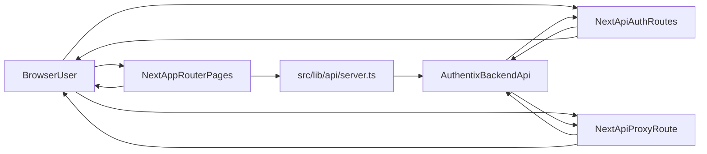
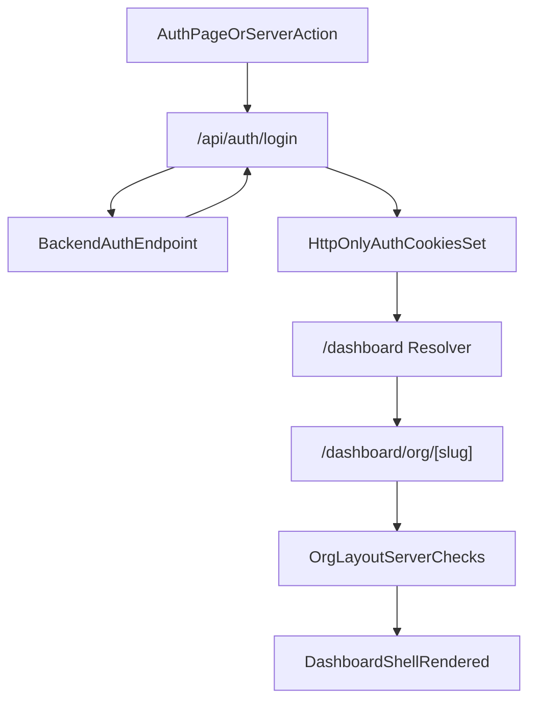

# SYSTEM_OVERVIEW.md

Deep system overview for the Authentix Dashboard frontend.

## 1) System Boundary

This repository is the frontend dashboard application. It does not own core certificate business persistence logic; that lives in the backend API.

Responsibilities in this repo:
- route rendering and navigation
- auth/session cookie handling through Next route handlers
- proxying validated API requests to backend
- organization-scoped UI flows (templates, imports, generation, billing, settings)

Out of scope in this repo:
- direct database writes/queries
- backend domain logic
- webhook processing

## 2) Runtime Topology

Key file anchors:
- `app/layout.tsx`
- `proxy.ts`
- `app/api/auth/*/route.ts`
- `app/api/proxy/[...path]/route.ts`
- `src/lib/api/client.ts`
- `src/lib/api/server.ts`

## 3) Request Lifecycle

### A) Page request lifecycle

1. Browser requests route.
2. `proxy.ts` evaluates route class (public/protected/static/api).
3. If protected and missing auth cookie, redirect to `/login`.
4. For org routes, server layout (`app/dashboard/org/[slug]/layout.tsx`) validates auth/session/profile/org.
5. Server components fetch data via `serverApiRequest`.
6. Rendered response streams to browser.

### B) API request lifecycle (browser initiated)

1. Client calls methods from `src/lib/api/client.ts`.
2. Request targets `/api/auth/*` or `/api/proxy/*`.
3. Route handler applies auth/security logic:
   - cookie extraction
   - bearer forwarding
   - allowlist/path checks (proxy path)
4. Request is forwarded to backend API.
5. Backend response is normalized and returned to client.

## 4) Authentication and Authorization Flow

Security notes:
- Cookie names are managed in `src/lib/api/server.ts`.
- Protected navigation checks run in both `proxy.ts` and org layout.
- URL slug identifies route context; backend JWT context enforces real authorization.

## 5) Certificate Workflow (UI to Backend)

Main implementation area:
- `app/dashboard/org/[slug]/generate-certificate/page.tsx`
- `app/dashboard/org/[slug]/generate-certificate/components/*`

Flow:
1. Load templates/import metadata.
2. Select template and fetch editor data.
3. Place and style fields.
4. Import/map recipient data (or manual entry).
5. Submit generation payload.
6. Display previews and export/download artifacts.

⚠️ Needs clarification: large-batch async generation completion path depends on backend worker completeness.

## 6) Module Dependencies (Frontend)

- App routes in `app/*` depend on:
  - UI components in `src/components/*`
  - API wrappers in `src/lib/api/*`
  - org context/hooks/utils in `src/lib/*`
- Feature module `src/features/templates/*` wraps template APIs/hooks for reusable composition.
- Dashboard shell composes navigation and context for all org-scoped pages.

## 7) Integration Points

- Backend API base resolved by `src/lib/config/env.ts`
- Supabase host allowance configured in `next.config.ts` for image/network policy needs
- Billing/payment actions rely on backend-provided Razorpay links

## 8) Test Coverage

Unit and component tests (Vitest 3.2, jsdom):

| File | Area | Count |
|---|---|---|
| `__tests__/auth/signup-action.test.ts` | Signup server action | 22 |
| `__tests__/auth/login-action.test.ts` | Login server action | 15 |
| `__tests__/components/ManualDataEntry.test.tsx` | Manual data entry component | ~20 |
| `__tests__/components/CertificateTable.test.tsx` | Certificate results table | 25 |
| `__tests__/components/ExportSection.test.tsx` | Export/generation overlay | ~15 |
| `__tests__/lib/automap.test.ts` | `autoMapForTemplate` pure fn | ~28 |

E2E tests (Playwright, `localhost:3000`, mocked API via `page.route()`):
- `e2e/auth.spec.ts` — login + signup flows
- `e2e/generate-certificate.spec.ts` — full certificate generation flow

Quality gates in order: `npm run typecheck` → `npm run lint` → `npm run test:run` → `npm run build`.

## 9) Operational Notes

- Node runtime expectation: 24.x
- Type/lint/build/test checks are primary quality gates in this repo
- Documentation sync should happen with architecture/API/workflow changes:
  - `README.md`
  - `AGENTS.md`
  - `projectmemory.md`

## 10) Related Documents

- `README.md`
- `AGENTS.md`
- `projectmemory.md`
- `FILE_INDEX.md`
